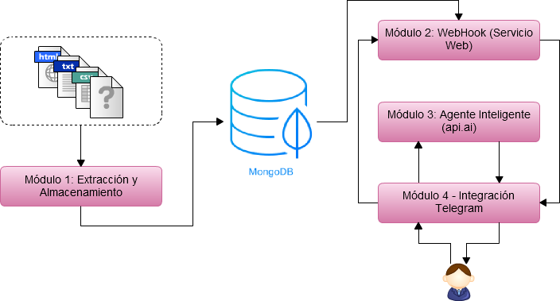

# Asistente virtual para información económica municipal

## Descripción

El proyecto surge para intentar solventar esta distancia entre ciudadanía y administración, acercando la información disponible en los portales de los ayuntamientos al bolsillo de la ciudadanía.

El **Asistente virtual para el acceso a información económica municipal**  es capaz de ofrecer la información a la ciudadanía mediante lenguaje común. De esta forma, el usuario o usuaria contactará con el asistente virtual y realizará preguntas como: ¿cuánto dinero se invierte en mi barrio? o ¿cuál es la deuda del ayuntamiento?; a partir de ahí, el asistente responderá con la información que obtiene de las páginas Web y portales de datos abiertos del ayuntamiento (Previamente guardados en una Base de Datos). Permitiendo, de esta manera, que los usuarios y usuarias adquieran información pública de forma fácil, rápida y confiable.

El desarrollo del asistente virtual es  modular y de código abierto para facilitar que sea fácilmente ampliable o exportable a cualquier ayuntamiento. Además, se está desarrollando utilizando el diseño centrado en la ciudadanía con el objetivo de que se adapte a sus necesidades reales. La estructura de módulos y relaciones es la siguiente:

- [Módulo 1: Extracción y Almacenamiento.](https://github.com/areahackerscivics/Chatbot_M1_Extraccion_y_Almacenamiento) Conjunto de scripts y procesos ETL (Extracción, transformación y carga) para recolectar la información de los distintos formatos que ofrece el ayuntamiento y estructurarlos en un base de datos MongoDB.
- [Módulo 2: WebHook (Servicio Web).](https://github.com/areahackerscivics/Chatbot_M2_WebHook_ServicioWeb) Servicio web que se encarga de obtener el texto y valor de la respuesta una vez identificada de que pregunta se trata.
- [Módulo 3: Agente Inteligente (api.ai).](https://github.com/areahackerscivics/Chatbot_M3_Agente_Inteligente) Copia del agente inteligente creado en [api.ai](https://api.ai/) para que pueda ser replicado.
- [Módulo 4: Integración Telegram.](https://github.com/areahackerscivics/Chatbot_M4.A_Integracion_Telegram) Se encarga de gestionar todos los mensajes que se reciben de Telegram. Se comunica con el módulo 3 y el módulo 2 para obtener la respuesta para el usuario.

## Guía de uso

Al tratarse de un proyecto modular puedes adoptar toda la estructura, algunos módulos sueltos, crear nuevos módulos o modificar los módulos existentes. Cada módulo contendrá la información de cómo ponerlo en funcionamiento y las entradas y salidas esperadas.

## Equipo

- Autores:
  - [Arnau Campos Albuixech](https://www.linkedin.com/in/arnau-campos-albuixech-759b23138)
  - [Valeria Alexandra Haro Valle](https://about.me/valexharo) | @ValeriaHaro
- Director del proyecto:
  - [Diego Álvarez](https://about.me/diegoalsan) | @diegoalsan

  ## Contexto del proyecto

  El trabajo que contiene este repositorio se ha desarrollado en el [**Àrea Hackers cívics**](http://civichackers.cc). Un espacio de trabajo colaborativo formado por [hackers cívics](http://civichackers.webs.upv.es/conocenos/que-es-una-hacker-civicoa/) que buscamos y creamos soluciones a problemas que impiden que los ciudadanos y ciudadanas podamos influir en los asuntos que nos afectan y, así, construir una sociedad más justa. En definitiva, abordamos aquellos retos que limitan, dificultan o impiden nuestro [**empoderamiento**](http://civichackers.webs.upv.es/conocenos/una-aproximacion-al-concepto-de-empoderamiento/).

  El [**Àrea Hackers cívics**](http://civichackers.cc) ha sido impulsada por la [**Cátedra Govern Obert**](http://www.upv.es/contenidos/CATGO/info/). Una iniciativa surgida de la colaboración entre la Concejalía de Transparencia, Gobierno Abierto y Cooperación del Ayuntamiento de València y la [Universitat Politècnica de València](http://www.upv.es).

   

  ## Términos de uso

  El contenido de este repositorio está sujeto a la licencia [Creative Commons Attribution-ShareAlike 4.0 International License](https://creativecommons.org/licenses/by-sa/4.0/)

  
